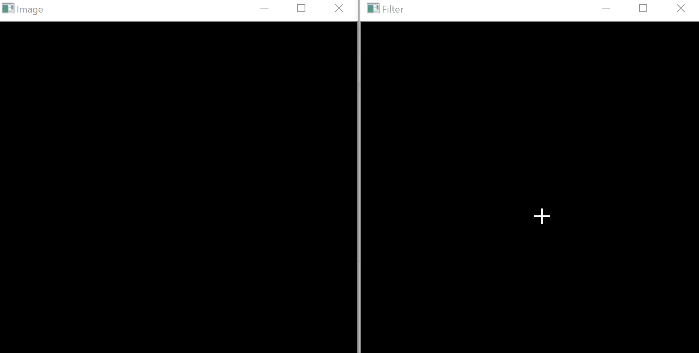
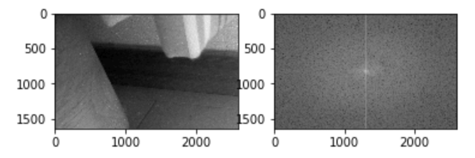

# Image_DFD
選択した画像のパワースペクトルを求め、マウスで設定した周波数部分を逆変換したものをリアルタイムで表示する.

●今回のプログラムは、以下のサイトを参考に作成しました.  
- https://www.hello-python.com/2018/02/16/numpy%E3%81%A8opencv%E3%82%92%E4%BD%BF%E3%81%A3%E3%81%9F%E7%94%BB%E5%83%8F%E3%81%AE%E3%83%95%E3%83%BC%E3%83%AA%E3%82%A8%E5%A4%89%E6%8F%9B%E3%81%A8%E9%80%86%E5%A4%89%E6%8F%9B/
  - PythonのOpenCVで画像をフーリエ変換と逆変換する記事.
  - フーリエ変換の流れとスペクトルの表示について参考にしました.
- https://lp-tech.net/articles/KMHfN/view?page=3
  - フーリエ変換とフィルタを使用した逆変換についての記事.
  - 同じく、画像のフーリエ変換とフィルタをかけての逆変換について参考にしました.
- http://rasp.hateblo.jp/entry/2016/01/24/204539
  - マウスを使った画像への操作の記事.
  - マウスのクリック判定や、画像上に円を設置することを元にして周波数の設定について参考にしました.

●プログラムの概要
  - 選択した画像を読み込み、二次元フーリエ変換したパワースペクトルを表示する.
  - 開かれたウィンドウ上でクリックすることで白い円を表示して使う周波数領域を指定、フィルタとして扱い逆変換する.
  - Python3のver.3.7.3を利用して作成した.
  
  
  - プログラムを起動後、読み込んだ画像のグレースケール画像とパワースペクトルを表示する.
  - その後二つのウィンドウ（Filter,Image）が開かれる.
    - ウィンドウFilterで扱う周波数領域を設定する.
      - 画像上をクリックすることで円が表示される.
      - この円に囲まれた領域を扱う周波数領域とする.
    - ウィンドウImageではウィンドウFilterを元に逆変換した画像が表示される.
      - クリックされ、円が表示されるごとに更新される.
      - 円を含めたFilterの画像を二値化し、フーリエ変換したものにかけることでフィルタをかけたようにしている.
  - Escキーを押すことで処理を終了.

●実行について  
　●実行の様子  
  
  
  
  ●端末上の表示  

  

画像サイズが大きいほど処理に時間がかかってしまった.